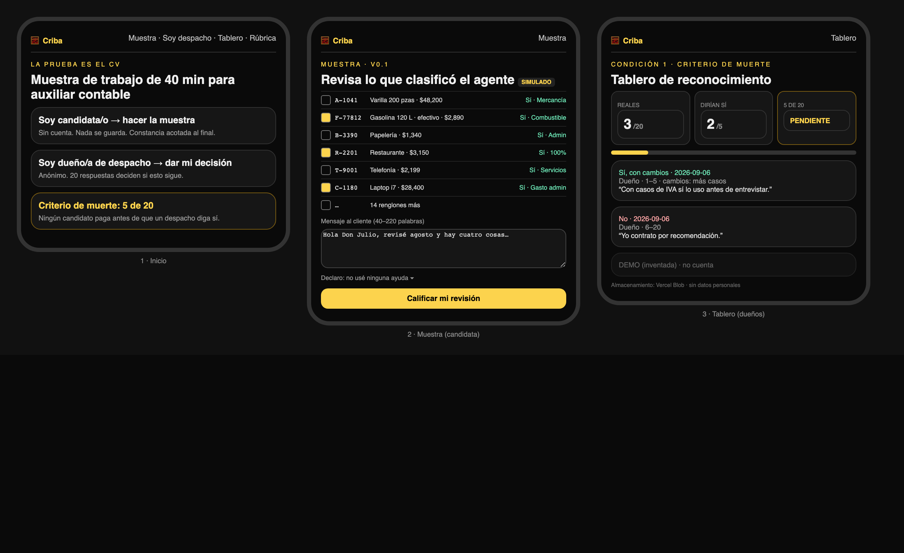
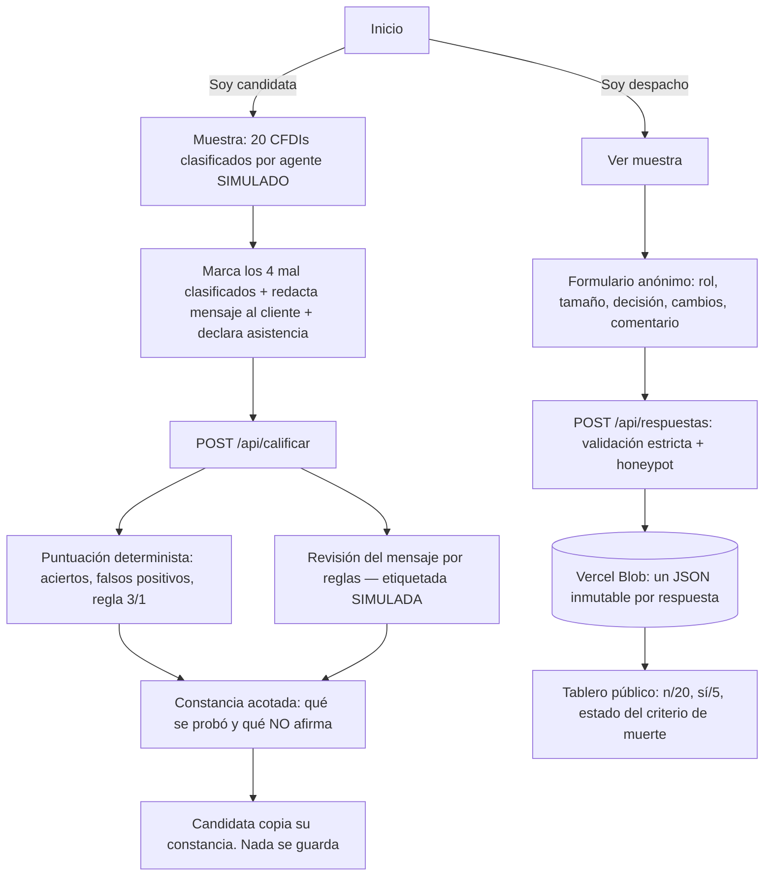
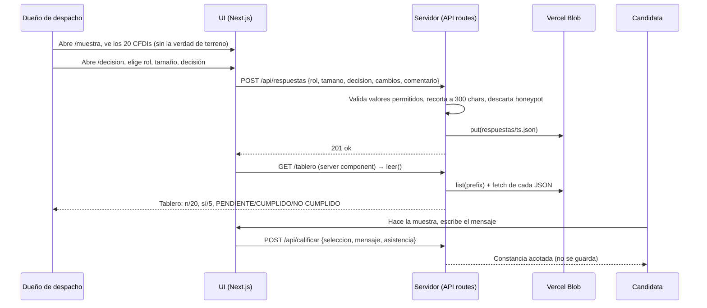

# Packet — w04-criba · "Criba: la prueba ES el CV"

> Escrito ANTES del código (disciplina del curso). Semana 4 · Chapter 3 "Twin Sparrows" · T2 · lente MONEY · Andrés Álvarez Morphy Namnum.
> Blueprint T2 (2026-09-05): vacío primario PROOF-OF-SKILL; cuña = muestra de trabajo de auxiliar contable que audita CFDIs clasificados por IA.

## El problema, en mis palabras

Una egresada de contaduría de UVM/UNITEC sin experiencia no tiene forma de demostrarle a un despacho de 5 personas que sabe juzgar lo que un sistema ya capturó. El despacho filtra con la entrevista del dueño y contrata por recomendación. La constancia estatal existe (CONOCER EC0744) y el vendor certifica su software (CONTPAQi/Kursa), pero ninguno certifica juicio y ningún despacho los pide. Mi declaración en el Blueprint fue **probar el reconocimiento antes de cobrarle a nadie**: si menos de 5 de 20 dueños dicen que preseleccionarían con la muestra, el proyecto cambia de vacío. Este ship convierte esa entrevista en producto: la muestra que el dueño puede ver como candidato, y la bitácora pública donde se cuenta su decisión.

## Usuario exacto

- **Quien decide (el receptor):** dueño o encargado de un despacho contable de 0–50 personas, sin área de RH, WhatsApp-first, que contrata una auxiliar al año y la entrena seis semanas. Le pedimos 5 minutos y una respuesta anónima.
- **Quien hace la muestra:** egresada de contaduría de universidad privada mid-tier, sin experiencia, desde su teléfono. No paga nada en este ship; su constancia es suya.
- Persona para la prueba sintética: **"Lic. Ramírez"**, 52, dueño de despacho de 4 personas en Puebla, lleva 60 clientes PyME, contrata por recomendación de su cuñada, desconfía de "plataformas", lee en el celular y abandona en silencio si algo tarda o le pide cuenta.

## Definición de éxito

**Antes de que cierre el módulo:** en la URL viva, (1) un dueño puede ver la muestra completa y registrar su decisión anónima en menos de 5 minutos sin crear cuenta; (2) el tablero público muestra el conteo real contra el criterio 5-de-20 con persistencia real; (3) una candidata puede hacer la muestra, recibir la constancia acotada y copiarla, sin que nada se guarde en el servidor.

## Mockup (generado)

*Generado por código (HTML → Playwright) antes de escribir la app; sin acceso a generación de imágenes por modelo en esta sesión.*

## Flujo

## Benchmark

**La mejor solución existente en el mundo para esto es** el examen de muestra de trabajo con reconocimiento pagado por un tercero: HackerRank/TestGorilla del lado del empleador y AWS Partner Network del lado de la credencial portátil (el empleador paga porque AWS le paga en descuentos y leads por tener gente certificada). **La mía difiere/localiza en** que invierte el orden: primero mide, en público, si el receptor mexicano (despacho de 5 personas, sin RH) cambiaría una decisión real de preselección, y solo después existe un precio (MX$400, lo paga la candidata); y en que certifica juicio sobre la salida de una máquina (auditar CFDIs clasificados por un agente), no el uso de un software (CONTPAQi) ni un estándar de captura (CONOCER EC0744).

## Vista larga (3 oraciones)

Si esta rebanada funciona, en tres años Criba es la constancia que una junior sin red manda por WhatsApp antes del CV, y que los despachos aceptan porque el vendor de software la distribuye y un Colegio la reconoce. La rúbrica pública versionada y la regla "ningún socio paga por un módulo" son los muros de carga: el canal distribuye, nunca escribe la rúbrica. La misma mecánica (auditar la salida de un agente) se extiende a auxiliares administrativas, 4.27 millones de personas, la puerta formal más grande del país para alguien sin red.

## Recorte de alcance (lo que NO construyo esta semana)

- No hay pago ni precio en el producto (el MX$400 es hipótesis del brief; el Blueprint exige reconocimiento antes de cobrar).
- No hay cuentas ni perfiles de candidatas; la constancia no se almacena (Condición 5).
- No hay IA real: la clasificación del agente es un dataset inventado y la revisión del mensaje son reglas etiquetadas SIMULADO (piso de stack: LLM + datos estructurados; la parte LLM va simulada y etiquetada, como permite el curso).
- No hay proctoring ni cámara (Condición 4). No hay estudio de validez (declarado en /rubrica como pendiente).
- No hay tablero por despacho ni exportación; un solo tablero público.

## Arquitectura y stack

| Capa | Elección | Por qué |
|---|---|---|
| Framework | Next.js 15 (App Router, JS) + Tailwind 4 | plantilla del curso; server components mantienen la verdad de terreno fuera del navegador |
| Datos estructurados | `lib/muestra.js`: 20 CFDIs inventados con `error` en 4; scorer determinista; revisor de mensaje por reglas | piso de stack "datos estructurados"; puntuación reproducible (Condición 3) |
| API | `/api/calificar` (POST, no persiste) · `/api/respuestas` (GET/POST, validación estricta, honeypot) | separar evidencia de la candidata (efímera) de decisiones del despacho (persistidas) |
| Persistencia | Vercel Blob, un JSON inmutable por respuesta, listado por prefijo | sin credenciales de Supabase en esta Mac; archivos inmutables evitan caché stale; cero datos personales |
| Hosting | Vercel (team `class19`), token en variables de entorno | piso de seguridad 1 |
| Datos personales | ninguno: no se pide nombre, correo ni teléfono | por eso no hay auth ni RLS (piso de seguridad 2–3 aplican solo si hay datos personales) |

## Piso de seguridad

1. Secretos: solo `BLOB_READ_WRITE_TOKEN`, en Vercel env; `.env.local` ignorado por git. 2. Auth: no aplica, no se guardan datos personales; el formulario lo dice. 3. RLS: no aplica (sin Supabase, sin datos de usuario). 4. Validación: valores permitidos por lista blanca, longitud 300, sin campos extra, honeypot; la selección de la muestra se acota a enteros 1–20. 5. Datos inventados y etiquetados en cada pantalla (cliente ficticio, respuestas DEMO marcadas y excluidas del conteo).

## Plan de prueba

**Mecánico:** (a) `calificarSeleccion([2,4,6,14])` → 4 aciertos, aprobado; `[2,4,6,3]` → 3 aciertos, 1 falso, aprobado; `[1,3,5]` → 0 aciertos, no aprobado. (b) POST `/api/respuestas` con `rol` inválido → 400; con campo extra → 400; con honeypot lleno → 200 sin guardar; válido → 201 y aparece en GET. (c) Comentario de 500 chars → se guarda recortado a 300. (d) `/muestra` no expone el campo `error` en el HTML ni en el bundle. (e) Tablero en producción refleja una respuesta real en < 5 s.
**Persona (Lic. Ramírez):** capturas de inicio → muestra → decisión → tablero, en un chat fresco, como él; registrar cada confusión; corregir la peor antes de la entrega.
